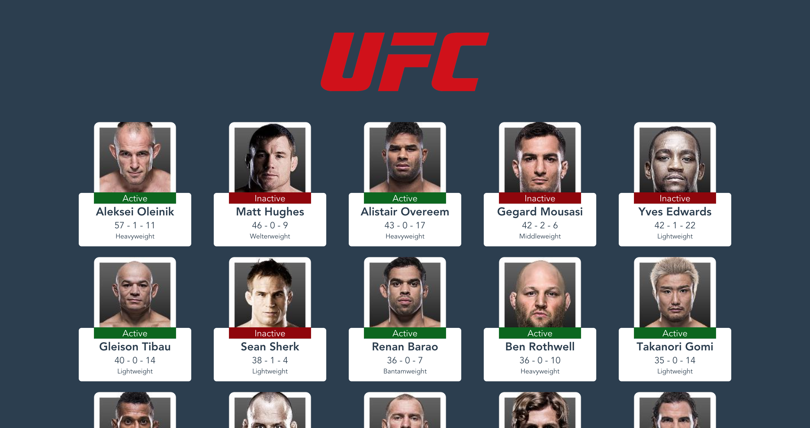

# UFC Fighters with GraphQL & Vue

This is a simple client and server to demo GraphQL usage with Vue.

A simple server that allows GraphQL queries interfaces with the UFC API to retrieve a list of fighters. This list of fighters can be retrieved using GraphQL.

# Server

The server is built using Express, Express-GraphQL and GraphQL. To run, cd into the server directory and run `npm i` , then run `npm start` ( or `npm run serve` if you plan on making changes ). The server starts on `http://localhost:8081` , a web ui for GraphQL is available there by default.

# Client
The Client is built using VueJS and Scaffolded using Vue CLI 3. The Apollo GraphQL client is used to query the server.

To run, cd into the client folder, and run `npm i`. Then run `npm run serve` to start the app. If you changed the port of the server runs on, you'll also need to update this in `client/src/main.js`
